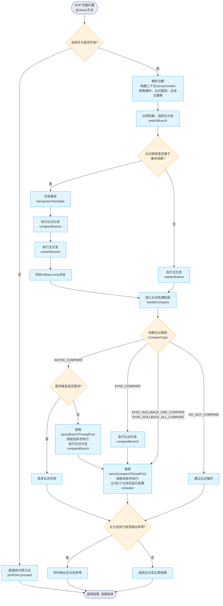

# Janus框架简介

Janus框架为<font color=#FF0000 >分流比对框架</font>，主要用于项目重构场景。

重构项目时需要重构一个个具体的java方法。该框架可以从下面3个方面辅助重构到上线的流程：

1. 强制要求以接口的方式统一新旧方法的定义，方便调用、切换新老方法或者进行新老方法之间的比对。
2. Janus框架的分流功能，可以方便开发者从多个维度灵活判断、切换新老方法。生产环境发现新方法有bug时，该功能还可以帮助开发者方便地切换回老方法。具体的判断、切换逻辑需要开发者根据业务场景自己实现（通过自定义[插件](#插件)）。
3. Janus框架的比对功能，可以方便开发者在生产环境并行新旧方法，并对新旧方法的运行结果进行异步比对。有多种模式供开发者选择，以适配非事务方法和事务方法。如果比对事务方法（方法内有修改数据库的逻辑），需要通过自定义[插件](#插件)来查询方法内修改过的数据（包括对数据库的增删改），否则框架无法对修改的数据进行比对。

## Janus框架实现思路

### 基于 Spring AOP

该框架基于Spring框架的AOP功能实现。在切面中决定返回新方法的结果还是旧方法的结果，并比对它们的结果是否一致。这样做对代码的入侵性较低，并且可以方便地控制新旧方法的切换、记录比对发现的差异。

### 分流比对过程的生命周期

将分流、比对的整个流程中，关键的步骤抽象成生命周期，用装饰模式实现功能增强。

详情见[比对流程生命周期](#比对流程生命周期)。

### 基于生命周期增强实现的插件功能

生命周期不对框架的使用者开放，仅用于框架作者自己实现Janus框架的一些核心功能。

基于生命周期实现的[插件](#插件)功能，可以允许框架使用者来自定义插件，灵活的添加各种功能。

### 部分关键的全局功能允许开发者自定义

[部分全局功能允许开发者自定义](#允许开发者自定义的功能)。这些功能都提供了接口，并且默认的Bean都设置了`@ConditionalOnMissingBean`，允许开发者根据需要自己定义这些功能。

基于约定优于配置的原则，一般情况下使用Janus框架的默认实现即可。


# Quick Start

### 添加Maven依赖

基于SpringBoot2.7x的Maven项目中，在`pom`文件里添加**janus-spring-boot-starter**即可使用。

```xml
    <dependency>
        <groupId>com.eredar</groupId>
        <artifactId>janus-spring-boot-starter</artifactId>
        <version>2.7.0</version>
    </dependency>
```

### 代码实现步骤

添加依赖后，需要根据下面的步骤来使用Janus框架：

1. [使用接口统一规范新旧方法并添加`@Janus`注解](#接口定义)。
2. [给`@Janus`注解设置唯一键](#唯一键)。
3. [选择合适的比对模式](#比对模式选择)。
4. [根据需要添加自定义插件](#插件)。


# 主要功能

## 功能开启

### 总开关

总开关默认开启。如果想关闭，可以通过配置文件添加如下配置：

```yml
janus:
  # 总开关：true-开启，false-关闭。默认：true
  is-open: false
```

### `@Janus`注解

给需要分流比对的方法添加`@Janus`注解，才能开启比对功能。

Janus框架强制要求统一新旧方法的定义。详情见[接口定义](#接口定义)。


## 唯一键

唯一键对Janus框架非常重要，用于区分不同的方法和每一次的调用。

### 方法唯一ID `methodId`

`@Janus`注解的`methodId`是方法级别的唯一ID，代表该方法，必须添加且在项目中全局不允许重复。

校验所有`methodId`是否重复的功能，是默认开启的。如果想关闭可以使用如下配置项：

```yml
janus:
  is-method-id-duplicate-check: false
```

### 每次比对的唯一键

`@Janus`注解的`businessKey`是每次比对的唯一键，需要自己定义。不设置默认为空。

建议添加该唯一键，用于记录比对日志时区分是哪次调用的日志。

**可以不用保证绝对唯一，尽量不容易重复即可**。

该唯一键的配置支持`SpEL`表达式。`SpEL`表达式不但支持从入参中获取数据，也支持调用静态Java方法。

### 示例

`buildKey(Object... values)`是一个Janus框架提供的静态方法，使用下划线`_`拼接入参，返回值是拼接后的字符串，可以直接使用。

```java
@Janus(
        methodId = "testMethod",
        compareType = CompareType.ASYNC_COMPARE,
        businessKey = "buildKey(#request.key, 'qqq')"
)
@Override
public TestResponse testMethod(TestRequest request) {
    // ......
}
```


## 接口定义

采用Janus框架，首先必须用接口统一新旧方法的格式，示例如下。

将要重构的方法定义在接口中：

```java
public interface TestInterface {

    TestResponse testMethod(TestRequest request);
}
```

实现`TestInterface`接口，将新方法（重构后的方法）作为**primary**分支，并添加`@Janus`注解。

<font color=#FF0000 >【注意】</font> 新方法所在的**Service**必须添加Spring框架的`@Primary`注解。这样在注入`TestInterface`接口时才能自动注入`PrimaryService`的Bean。

```java
@Primary
@Service
public class PrimaryService implements TestInterface {

    @Janus(
            methodId = "testMethod",
            compareType = CompareType.ASYNC_COMPARE,
            businessKey = "#request.key"
    )
    @Override
    public TestResponse testMethod(TestRequest request) {
        // ......
    }
}
```

实现`TestInterface`接口，将旧方法作为**secondary**分支。

<font color=#FF0000 >【注意】</font> 旧方法所在的**Service**必须添加Janus框架的`@Secondary`注解。这样Janus框架才能找到**secondary**分支。

```java
@Secondary
@Service
public class SecondaryService implements TestInterface {

    @Override
    public TestResponse testMethod(TestRequest request) {
        // ......
    }
}
```


## 分流

按照上面的接口定义方式，Janus框架必须决定返回哪个分支的结果。

开发者可以通过自定义[插件](#插件)，自己实现插件的`switchBranch`方法，在该方法中设置`JanusContext`的`masterBranchName`属性，即可自定义分流规则。示例如下：

```java
@Component
public class SwitchJanusPlugin implements JanusPlugin {

    @Override
    public void switchBranch(JanusContext context) {
        // ......
        context.setMasterBranchName(JanusConstants.PRIMARY);
        // 或者
        context.setMasterBranchName(JanusConstants.SECONDARY);
    }
}
```

### 允许自定义所有方法默认返回的分支

如果未通过[插件](#插件)来自定义分流规则，默认返回**secondary**分支的结果。

该规则可以通过配置文件修改为**primary**。

```yml
janus:
  # 未配置具体分流开关时默认使用哪个分支。默认：secondary
  # 可选值：primary (新分支), secondary (老分支)
  default-master-branch: primary
```


## 比对

### 比对模式简介

可以通过`@Janus`注解的`compareType`来选择比对模式：

- **DO_NOT_COMPARE**: 只执行主分支，不比对
- **SYNC_COMPARE**: 同步执行2个分支，然后比对
- **ASYNC_COMPARE:** 异步执行比对分支，然后比对
- **SYNC_ROLLBACK_ONE_COMPARE**: 同步执行2个分支，回滚比对分支的事务，然后比对
- **SYNC_ROLLBACK_ALL_COMPARE**: 同步执行2个分支，回滚2个分支的事务，然后比对

### 比对模式选择

通过`@Janus`注解的`compareType`设置比对模式。

可以根据下面几点建议，来判断应该选择哪种模式。

1. 非事务接口建议选择`ASYNC_COMPARE`模式。
2. 事务接口根据需要选择`SYNC_ROLLBACK_ONE_COMPARE`或者`SYNC_ROLLBACK_ALL_COMPARE`模式。
   - 选择`SYNC_ROLLBACK_ALL_COMPARE`模式时，主分支和比对分支的事务执行后都会被回滚，因此不会将任何修改提交到数据库，故不可以用于正式上线生产环境的方法。
   - `SYNC_ROLLBACK_ONE_COMPARE`模式可以用于正式上线生产环境的事务方法，但是要注意选对正确的主分支`masterBranch`。
3. `SYNC_COMPARE`模式一般用不到，如果特殊情况下需要可以使用。
4. 如果想关闭比对功能，选择`DO_NOT_COMPARE`模式。

```java
@Janus(
        methodId = "testMethod",
        compareType = CompareType.SYNC_ROLLBACK_ONE_COMPARE,
        businessKey = "#request.key"
)
```

如果未指定`compareType`，默认为`ASYNC_COMPARE`。也可以通过配置文件修改默认选项。

```yml
janus:
  # 默认比对模式。默认：ASYNC_COMPARE (异步比对)
  default-compare-type: SYNC_COMPARE
```

### <font color=#FF0000 >重要</font>：MyBatis一级缓存清理

比对事务方法的场景，需要实现对持久层框架的缓存清理，防止因为事务回滚导致的缓存与数据库数据不一致。

比如MyBatis框架存在一级缓存，一级缓存与session绑定。事务结束前，session不会中断，需要在回滚事务后清理一级缓存。

选择`SYNC_ROLLBACK_ONE_COMPARE`或者`SYNC_ROLLBACK_ALL_COMPARE`模式时，强制实现`JanusRollbackClearCache`接口。比如MyBatis框架的项目中需要注入下面的Bean。

```java
@Component
public class JanusRollbackClearCacheImpl implements JanusRollbackClearCache {

    @Autowired
    private SqlSessionTemplate sqlSessionTemplate;

    @Override
    public void clearCache() {
        sqlSessionTemplate.clearCache();
    }
}
```

其他持久层框架也需要考虑同样的问题。如果不需要清理缓存，也必须注入一个空的实现：

```java
@Component
public class JanusRollbackClearCacheImpl implements JanusRollbackClearCache {

    @Override
    public void clearCache() {
    }
}
```

### 自定义执行比对分支的线程池

`janusBranchThreadPool`线程池用于`ASYNC_COMPARE`模式下，异步执行比对分支。

该线程池可能会有很大压力，因为异步执行比对分支会很耗时。需要根据系统情况自己调整线程数。

不建议修改该线程池的拒绝策略。

可以[自己注入该线程池](#允许开发者自定义的功能)，名字一样（必须使用`janusBranchThreadPool`这个名字）即可替换框架提供的线程池。

注意，由于默认开启了[流量均衡](#流量均衡)，`janusBranchThreadPool`默认设置`core-pool-size`等于`maximum-pool-size`。如果`maximum-pool-size`比`core-pool-size`大，由于`ThreadPoolExecutor`线程池只有在队列占满时才会创建非核心线程，而Janus框架的[流量均衡](#流量均衡)功能默认在队列占用达到比例（如80%）时就丢弃任务并限流，导致队列永远无法被填满，从而无法触发创建到 maximum-pool-size 的线程。”

也可以通过配置项来自定义框架提供的线程池的配置：

```yml
janus:
  janus-branch-thread-pool:
    # 核心线程数，默认16
    core-pool-size: 20
    # 最大线程数，默认16
    maximum-pool-size: 20
    # 线程存活时间
    keep-alive-time: 60
    # 时间单位
    # 可选值: NANOSECONDS, MICROSECONDS, MILLISECONDS, SECONDS, MINUTES, HOURS, DAYS
    unit: SECONDS
    # 队列大小
    work-queue-size: 1000
    # 拒绝策略
    # 可选值: CallerRunsPolicy, AbortPolicy, DiscardPolicy, DiscardOldestPolicy
    rejected-handler: CallerRunsPolicy
```

### 自定义异步比对线程池

`janusCompareThreadPool`线程池用于异步执行比对2个分支的结果的逻辑。

一般情况下，该线程池的压力不大，因为比对过程消耗资源较少。

不建议修改该线程池的拒绝策略。

可以[自己注入该线程池](#允许开发者自定义的功能)，名字一样（必须使用`janusCompareThreadPool`这个名字）即可替换框架提供的线程池。

也可以通过配置项来自定义框架提供的线程池的配置：

```yml
janus:
  janus-compare-thread-pool:
    # 核心线程数，默认3
    core-pool-size: 2
    # 最大线程数，默认5
    maximum-pool-size: 4
    # 线程存活时间
    keep-alive-time: 30
    # 时间单位 (可选值: NANOSECONDS, MICROSECONDS, MILLISECONDS, SECONDS, MINUTES, HOURS, DAYS)
    unit: SECONDS
    # 队列大小
    work-queue-size: 500
    # 拒绝策略 (可选值: CallerRunsPolicy, AbortPolicy, DiscardPolicy, DiscardOldestPolicy)
    rejected-handler: AbortPolicy
```

### 支持在比对时忽略指定字段

如下面示例，需要通过`@Janus`注解的`ignoreFieldPaths`配置要忽略的字段的路径。必须以`res.`开头，`res`即代表目标方法的返回对象。

```java
@Janus(
        methodId = "testMethod",
        businessKey = "#request.key",
        compareType = CompareType.ASYNC_COMPARE,
        ignoreFieldPaths = {"res.str1", "res.list.str2"}
)
@Override
public TestResponse testMethod(TestRequest request) {
    // ......
}
```

`TestResponse`内部结构：

```java
public class TestResponse {
    private Integer number;
    private String str1;
    private List<TestDTO> list;
}
public class TestDTO {
    private String str2;
    private String str3;
}
```

### 流量均衡

比对模式为`ASYNC_COMPARE`表示使用`janusBranchThreadPool`线程池异步执行比对分支，流量较高时该线程池会面临巨大压力。所以该线程池的默认拒绝策略为`DiscardOldestPolicy`。这样会导致一个严重的隐患，如果某些选择了`ASYNC_COMPARE`的方法运行时间很长或者流量巨大，会导致其他方法都无法正常运行。

执行比对分支`compareBranch`的线程池`janusBranchThreadPool`的队列被占用到一定比例时，会触发流量自动平衡功能，限制当前流量高的方法的比对流量(不影响它们的主分支的运行，仅丢弃比对任务)。

相关配置项如下：

```yml
janus:
  async-compare-throttling:
    limit-ratio: 0.5 # 默认为0.8，表示线程池的队列被占用了 80% 才会触发流量自动平衡
    isOpen: false # 默认为true，想关闭该功能可以设置为false
```

### 通过自定义插件查询事务方法的增删改结果

比对事务方法（对数据库有增删改操作的方法）时，需要自定义插件来查询2个分支对数据库的操作结果，用来进行比对。只要查询并正确设置queryRes，Janus框架会自动比对其结果。

示例如下，注意必须重写`getOrder()`方法，返回值大于0，否则无法在事务回滚前查到数据。

```java
@Component
public class QueryDataJanusPlugin implements JanusPlugin {

    @Override
    public int getOrder() {
        return 10000;
    }

    @Override
    public void afterPrimaryExecute(JanusContext context) {
        // 查询 primary 分支增删改结果
        List<TestDataDTO> queryRes = this.queryData(context);
        context.setPrimaryQueryRes(queryRes);
    }

    @Override
    public void afterSecondaryExecute(JanusContext context) {
        // 查询 secondary 分支增删改结果
        List<TestDataDTO> queryRes = this.queryData(context);
        context.setSecondaryQueryRes(queryRes);
    }

    /**
     * 查询增删改结果
     */
    public List<TestDataDTO> queryData() {
        // ......
    }
}
```

## Janus生命周期与插件

### 比对流程生命周期

每次添加了`@Janus`注解的方法被调用，Janus框架因此触发的整个分流比对过程，被称为生命周期。

本次调用、比对都结束后，生命周期结束。

1次分流比对流程的生命周期分为4个阶段：

1. 分流：switchBranch
2. 执行`primary`分支：primaryExecute
3. 执行`secondary`分支：secondaryExecute
4. 比对：compare

### 插件

根据Janus框架4个生命周期，可以添加插件来实现各种自定义的扩展功能，比如日志记录等。

支持全局/方法级插件，支持设置插件高低优先级来自定义插件执行顺序，支持插件之间数据的互相访问。

### 插件优先级

由于插件通过责任链模式实现，类似Tomcat的过滤器，所以插件一定有一个执行顺序。通过重写`JanusPlugin`的`getOrder()`方法可以设置插件的优先级。优先级逻辑与Spring的AOP功能一致，优先级数字越小，优先级越高。

最高优先级为`JanusPlugin.HIGHEST_PRECEDENCE`，等于int类型最大值`Integer.MIN_VALUE`。

最低优先级为`JanusPlugin.LOWEST_PRECEDENCE`，等于int类型最大值`Integer.MAX_VALUE`。

> [!IMPORTANT]
> JanusPlugin的优先级，大于0的表示会在事务回滚前执行，可以查询事务内的数据；小于0的表示会在事务回滚后执行。优先级不可以等于0。只有选择`SYNC_ROLLBACK_ONE_COMPARE`或者`SYNC_ROLLBACK_ALL_COMPARE`模式才会有事务。

插件默认优先级为最高优先级，最先进入，最后结束。

```yml
@Component
public class TestJanusPlugin implements JanusPlugin {

    @Override
    public int getOrder() {
        return 10000;
    }
}
```

### 插件生命周期

插件分为7个可实现方法：

1. 分流：switchBranch
2. `primary`分支执行前：beforePrimaryExecute
3. `primary`分支执行后：afterPrimaryExecute
4. `secondary`分支执行前：beforeSecondaryExecute
5. `secondary`分支执行后：afterSecondaryExecute
6. 比对前：beforeCompare
7. 比对后：afterCompare

### 新建普通插件

实现`JanusPlugin`接口可以新建插件。注意要将插件注入Spring容器。

比如新建分流插件，用于自定义分流逻辑。

```java
@Component
public class SwitchJanusPlugin implements JanusPlugin {

    @Override
    public void switchBranch(JanusContext context) {
        // ......
        context.setMasterBranchName(......);
    }
}
```

### 新建携带数据的插件

实现`AbstractDataJanusPlugin`抽象类，可以新建携带数据的插件。每一次进入Janus的切面，插件数据都是新建的，同一次比对过程中插件数据是同一个对象、是可传递的。

```java
@Component
public class GetLogJanusPlugin extends AbstractDataJanusPlugin<GetLogJanusPlugin.GetLogJanusPluginData> {

    @Override
    public void afterPrimaryExecute(JanusContext context) {
        // 获取当前插件本次分流比对的相关数据
        GetLogJanusPluginData pluginData = this.getPluginData(context);
        // ......
        pluginData.setLogStr1("......");
    }

    @Override
    public void afterSecondaryExecute(JanusContext context) {
        // 获取当前插件本次分流比对的相关数据，与第一次获取的是同一个对象
        GetLogJanusPluginData pluginData = this.getPluginData(context);
        // ......
        pluginData.setLogStr2("......");
    }

    @Data
    public static class GetLogJanusPluginData {
        private String logStr1;
        private String logStr2;
    }
}
```

### 获取其他插件的数据

```java
@Component
public class SaveLogJanusPlugin implements JanusPlugin {

    @Override
    public void afterCompare(JanusContext context) {
        // 获取 GetLogJanusPlugin 插件本次分流比对的相关数据
        GetLogJanusPlugin.GetLogJanusPluginData getLogJanusPlugin =
                context.getOtherPluginData(GetLogJanusPlugin.class);
        // ......
    }
}
```

### 添加插件到指定方法

```java
@Janus(
        methodId = "testMethod",
        businessKey = "#request.key",
        compareType = CompareType.ASYNC_COMPARE,
        plugins = {GetLogJanusPlugin.class, SaveLogJanusPlugin.class}

)
@Override
public TestResponse testMethod(TestRequest request) {
    // ......
}
```

### 全局插件，`@Global`注解

使用注解可以让插件变为全局插件，不用加在@Janus注解中也能生效。

注意，全局插件每个添加了`@Janus`注解的方法都会生效，无法让某个方法不生效。

```java
@Global
@Component
public class GlobalJanusPlugin implements JanusPlugin {
    // ......
}
```

## JanusAspect切面执行后获取信息

通过`JanusAspectSupport`可以在JanusAspect切面执行后获取信息，目前仅支持获取`masterBranchName`。有以下三个结果：

- `primary`: primary分支
- `secondary`: secondary分支
- `null`: 表示没有分流结果，有可能Janus功能被关闭，有可能不是在本线程执行的Janus功能，也有可能添加了`@Janus`注解的方法尚未执行。

由于一条链路上可能有多个添加了`@Janus`注解的方法，所以获取该信息必须指定`methodId`，示例：

```java
String masterBranchName = JanusAspectSupport.getMasterBranchName("methodId");
```

## 允许开发者自定义的功能

以下功能都提供了接口，并且框架提供的Bean都设置了`@ConditionalOnMissingBean`，允许开发者根据需要自己定义这些功能。

一般情况下使用Janus框架的默认实现即可。

- `JanusCompare`接口：实现该接口可以自己定义比对功能。
- `JanusRollback`接口：实现该接口可以自己定义事务回滚功能。
- `janusBranchThreadPoolMetricsProvider`接口：如果开发者使用了自己定义的线程池，并且线程池的实现不是`ThreadPoolExecutor`类型，则需要开发者自己实现该接口，用来提供线程池的队列的相关数据。该接口有2个抽象方法，`getQueueSize()`方法用于获取线程池队列信息当前的size；`getQueueCapacity()`方法用于获取线程池队列的最大容量（可以不用很精确）。

Janus框架中用到的2个线程池，都允许使用者自己注入：

- [`janusBranchThreadPool`](#自定义执行比对分支的线程池)
- [`janusCompareThreadPool`](#自定义异步比对线程池)

也可以使用`JanusThreadPoolComponent`来获取框架提供的线程池，自己做增强操作后再注入Spring。

这样既能增强线程池，又能保留在配置文件中配置线程池属性的效果，并且十分方便。

示例：

```java
@Configuration
public class ThreadPoolConfig {

    @Autowired
    private JanusThreadPoolComponent janusThreadPoolComponent;

    @Bean
    public ExecutorService janusBranchThreadPool() {
        // 创建原始线程池
        ExecutorService janusBranchThreadPool = janusThreadPoolComponent.getJanusBranchThreadPool();
        // 使用 ContextAwareExecutorService 进行增强，确保父线程上下文（如数据源标识）在子线程中可用
        return new ContextAwareExecutorService(janusBranchThreadPool)
                .addContextPropagator(
                        DataSourceContextHolder::getDataSource,
                        DataSourceContextHolder::setDataSource,
                        DataSourceContextHolder::removeDataSource
                );
    }
}
```

## 上下文对象JanusContext相关API

同一个生命周期内，从开始到结束全部使用同一个上下文对象传递数据。

不同的生命周期不会共用上下文对象。

上下文对象分为接口`JanusContext`和实现`JanusContextImpl`，是为了实现一个简单的权限管理。`JanusContext`接口的所有API都允许开发者在插件中调用，但是`JanusContextImpl`中未暴露在`JanusContext`接口的API不建议开发者调用。如果确实需要使用，可以对上下文对象做强制类型转换：

```java
JanusContextImpl janusContextImpl = (JanusContextImpl) context;
```

### JanusContext接口相关API

| 方法签名 | 返回值类型 | 功能描述 |
| :--- | :--- | :--- |
| `getMethodId()` | `String` | 获取方法的唯一标识 |
| `getBusinessKey()` | `String` | 获取业务主键 |
| `getCompareType()` | `CompareType` | 获取比对类型 |
| `getArgs()` | `Object[]` | 获取方法入参 |
| `isCompare()` | `Boolean` | 是否比对 |
| `isNotCompare()` | `Boolean` | 是否不比对 |
| `setIsCompare(Boolean isCompare)` | `void` | 设置是否比对 |
| `isAsyncCompare()` | `Boolean` | 是否异步比对 |
| `getMasterBranchName()` | `String` | 获取主分支名称 |
| `getPrimaryBranch()` | `BranchInfo` | 获取primary分支 |
| `getSecondaryBranch()` | `BranchInfo` | 获取secondary分支 |
| `getMasterBranch()` | `BranchInfo` | 获取主分支 |
| `getCompareBranch()` | `BranchInfo` | 获取比对分支 |
| `setPrimaryQueryRes(Object queryRes)` | `void` | 设置primary分支的查询结果 |
| `setSecondaryQueryRes(Object queryRes)` | `void` | 设置secondary分支的查询结果 |
| `getCompareRes()` | `CompareRes` | 获取比对结果 |
| `setMasterBranchName(String masterBranchName)` | `void` | 设置主分支名称 |
| `getIgnoreFieldPaths()` | `Set<String>` | 获取比对时需要忽略的字段路径集合 |
| `getAnnotation(Class<T> annotationClass)` | `<T extends Annotation> T` | 获取[自定义注解](#自定义注解) |
| `getPrimaryTime()` | `Long` | 获取primary分支的执行耗时（纳秒） |
| `getSecondaryTime()` | `Long` | 获取secondary分支的执行耗时（纳秒） |
| `getOtherPluginData(Class<? extends AbstractDataJanusPlugin<OTH>> pluginClass)` | `<OTH> OTH` | 获取其他插件的数据 |

### 自定义注解

允许开发者自定义注解，与`@Janus`一起添加在方法上。配合自定义插件可以实现各种扩展功能。

在自定义插件中，可以用如下方式获取自定义注解的信息：

```java
@Override
public void switchBranch(JanusContext context) {
    TestAnnotation annotation = context.getAnnotation(TestAnnotation.class);
    // ......
}
```


## 日志打印

日志打印采用`slf4j`抽象层框架，不提供具体实现。

运行日志级别为`DEBUG`级别。异常日志为`ERROR`级别。

有对插件的每个方法进行运行时间追踪的日志，为`TRACE`级别。


# 框架技术亮点

### 插件数据对象自动反射创建

有些JanusPlugin需要在一次比对中的各个生命周期之间传递数据，甚至跨插件传递数据。Janus框架的`AbstractDataJanusPlugin`，可以实现自动获取泛型上的插件数据类型，然后自动反射创建并保存到本次比对的上下文`JanusContext`中。

实现方式参考了各种流行的JSON框架的`TypeReference`的原理，这里以Janus框架用到的Jackson框架为例。`TypeReference`可以使Jackson框架在将Json字符串反序列化成对象时，方便开发者设置目标对象的类型，包括泛型。但是Java的泛型会在编译时擦除，唯一的例外是继承一个抽象类，抽象类上面设置的泛型不会被擦除。`TypeReference`就借用了这个特性。`TypeReference`被设计成一个抽象类，要new一个`TypeReference`对象，必须用匿名内部类实现继承效果，`TypeReference`会在构造方法里面记录泛型的类型，这样就成功获取了泛型。

回到`AbstractDataJanusPlugin`及其各种实现类，正好模拟了类似`TypeReference`的场景。`AbstractDataJanusPlugin`上面设置了插件数据的泛型，插件也继承了`AbstractDataJanusPlugin`。这样即可在`AbstractDataJanusPlugin`的构造方法中记录了插件数据类型的泛型，并通过反射创建插件对象。不过Janus框架里没有记录更深层级的泛型，因为这里的场景与Jackson框架不同，不需要支持太深层级的泛型。

### 比对事务方法时，通过savepoint回滚事务

对于事务方法（对数据库有增删改操作的方法），必须实现回滚才能进行比对。由于涉及事务，数据一致性也是需要考虑的问题。

Janus框架采用了自己创建一个总事务来包含2个分支的方式，一定程度上保证数据一致性。

首先在`JanusAspect`中，使用`TransactionTemplate`在最外层开启了一个包含两个分支的总事务。

然后在总事务那，再通过savepoint机制创建子事务，即可灵活控制是否回滚每个分支的事务，实现执行2个分支（即相同代码执行2遍）然后比对其结果，同时也不影响生产环境正常使用该方法的效果。子事务的具体实现，则是借用Spring框架的`@Transactional`注解，设置`propagation = Propagation.NESTED`开启savepoint。在`try-finally`中通过`TransactionAspectSupport.currentTransactionStatus().setRollbackOnly();`实现单个子事务的回滚操作。详情见Janus框架`JanusRollbackDefault`类。

还有一种手动开启savepoint的实现方式放在`JanusRollbackDefault2`文件中。由于用不上所以注释掉了，需要的话可以放开注释自己查看。手动开启savepoint唯一的好处就是可以在开启savepoint时设置`name`属性。

### 责任链模式实现插件功能，方便开发者扩展

Janus框架面对的使用场景，非常容易遇到根据当前业务进行功能扩展的需求。通过类似责任链模式实现的插件功能，允许开发者自定义插件，还能设置插件执行顺序，能够在不添加很多抽象类、不修改Janus框架的前提下扩展各种自定义功能，非常方便。

### 依赖Jackson框架实现分支结果比对

`JanusJsonUtils`类中`compare`方法，实现了对Json格式字符串或者Java对象的比对功能，依赖Jackson框架。支持忽略指定字段。

### 流量均衡功能

要实现[流量均衡](#流量均衡)功能，必须判断以下2点：

1. 线程池压力是否过大。线程池压力不大无需限流。
   - 实现方式：通过判断线程池队列当前占用比例来判断线程池当前的压力。
   - 详情见`JanusAspect`的`isHighPressure()`方法。
2. 当前方法占用线程池是否过高。如果当前方法对线程池的占用等于或者超过平均值，判定为当前方法占用线程池太多，需要限流。
   - 实现方式：使用一个全局唯一的`ConcurrentHashMap`来记录每个方法对线程池的占用情况。该记录是动态的，每次切面进入，对应的方法+1；每次切面中的异步执行比对分支的操作结束，对应的方法-1。只要判断线程池压力过大，则先通过该map来计算当前所有方法的平均流量，然后获取当前方法的流量进行比较。注意，只要当前方法的流量**大于等于**平均流量即可判定需要限流，这样做可以避免只有1个方法有流量时无法触发限流的问题。
   - 详情见`JanusAspect`的`shouldThrottle(Method method)`方法。

### 获取动态代理对象的target的工具方法

`JanusAopUtils`工具类可用于获取动态代理对象的target，或者target的类型。

### 基于Spring框架实现对SpEL表达式的支持

`JanusExpressionEvaluator`继承Spring框架的`CachedExpressionEvaluator`，并自定义缓存`expressionCache`来实现解析、缓存SpEL表达式的效果。

## 流程图



